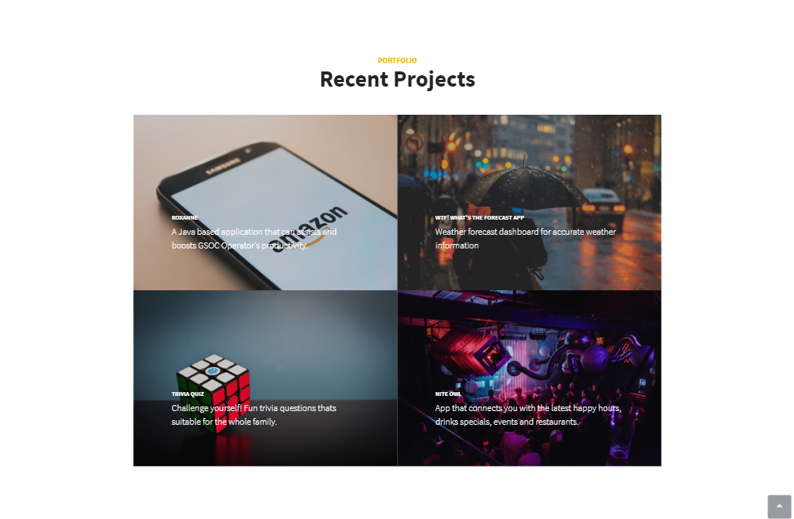
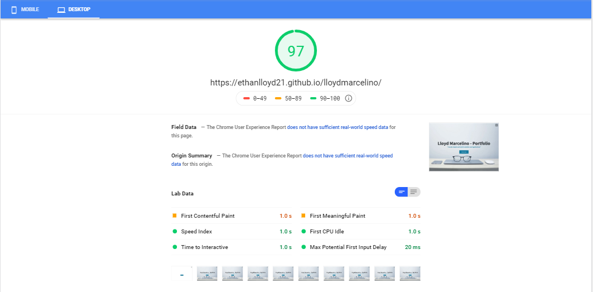

# Lloyd Marcelino - Portfolio
My Professional Portfolio were you'll find my work and what I've accomplish
# Contents
* My Portfolio 

* Tells a story of my passion and inner personality

* My expertise lies in giving the utmost experience to the customer

* Based on what I accomplised and learned

* If you are satisfied, let me build what you need.

# SEO Optimization
* Google Search Console - enhancing the visibility of my website on Google search engine. Also helps to measure the search traffic and performance.

* Keywords (meta elements) - using the most searchable keywords (web developer, web designer, etc.) for search engine indexing. 

# Deployement
View my Portfolio <a href="https://ethanlloyd21.github.io/lloydmarcelino/" rel="nofollow"> here.</a>

# Built With
* HTML5
* BOOTSTRAP4
* CSS3
* JavaScript
* jQuery 

## Author
* Lloyd Marcelino, 2020

# License 
This project is licensed under the MIT License - see the LICENSE.md file for details
